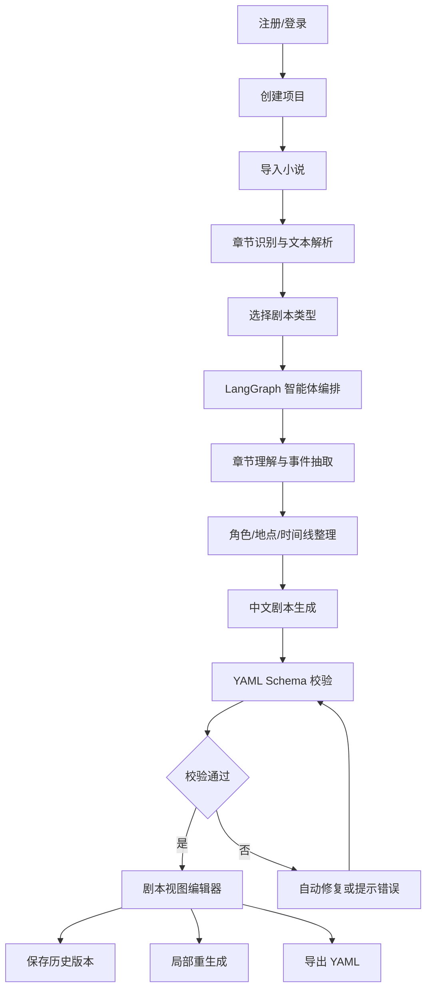

# AI 小说转剧本工具需求文档

版本：v1.0  
日期：2026-06-05  
状态：已根据当前确认项重做

## 1. 项目背景

很多小说作者希望将自己的作品改编成剧本，但小说到剧本之间存在明显门槛：需要拆解章节、提炼事件、梳理人物关系、合并情节、重写对白、转换场景，并最终整理成稳定格式。

本项目拟开发一款 AI 辅助剧本创作工具，帮助作者将 3 个章节以上的小说文本自动转换为结构化 YAML 剧本初稿。用户可以在 Web 应用中导入小说，选择剧本类型，由不同写作智能体完成改编，并在剧本视图编辑器中继续修改，最终导出 YAML。

参考项目：[HBAI-Ltd/Toonflow-app](https://github.com/HBAI-Ltd/Toonflow-app)。本项目参考其“小说导入、章节事件提取、智能体编排、结构化剧本生成、可持续编辑”的实现思路，但产品形态确定为 Web 应用，MVP 聚焦小说到 YAML 剧本，不做图片、分镜、视频生成。

## 2. 已确认产品决策

- 产品形态：Web 应用。
- 前端技术：React。
- 后端技术：Python。
- 智能体编排：LangGraph。
- 首期模型供应商：阿里百炼平台 API。
- 输入章节数量：至少 3 章。
- 输入语言：支持多语言小说。
- 输出语言：最终剧本统一输出中文。
- 输入格式：支持粘贴文本、`.txt`、`.docx`、`.pdf`、`.epub`。
- 剧本类型：用户可选择，不同剧本类型调用不同写作智能体。
- 输出形态：前期先输出一个完整 YAML 剧本文档。
- 改编参数：用户无需指定目标集数、时长、风格、受众、改编尺度，由系统根据小说内容自动判断。
- 改编原则：尽量忠实原文。
- 编辑方式：剧本视图编辑器，背后同步结构化 YAML。
- 历史版本：需要。
- 局部重生成：需要。
- 账号能力：需要账号登录和云端保存。
- 协作能力：暂不做多用户协作。
- 导出格式：只需要 YAML。

## 3. 产品目标

### 3.1 用户目标

- 让小说作者不需要掌握专业剧本格式，也能快速得到剧本初稿。
- 让作者能在接近剧本阅读习惯的界面中继续编辑内容。
- 让生成结果可追溯到原小说章节，方便作者判断是否忠实原文。
- 让最终 YAML 可被后续工具、智能体或人工流程继续处理。

### 3.2 系统目标

- 自动读取至少 3 章小说并完成章节解析。
- 将多语言小说输入统一改编为中文剧本。
- 基于剧本类型选择对应 LangGraph 智能体流程。
- 生成结构化、可校验、可编辑、可导出的 YAML。
- 支持保存历史版本和对局部内容重新生成。
- 支持账号登录和云端项目保存。

## 4. 用户角色

### 4.1 小说作者

主要用户。导入自己的小说，选择剧本类型，生成初稿，在剧本视图中修改，导出 YAML。

### 4.2 内容编辑

辅助用户。帮助作者评估小说改编潜力，检查人物、情节、节奏和对白。

### 4.3 系统管理员

维护模型供应商配置、系统参数、用户状态和异常任务。MVP 阶段不需要复杂后台，但应预留管理接口。

## 5. 核心使用流程



## 6. 功能范围

### 6.1 账号登录

用户应能注册、登录、退出。

基础字段：

- 用户 ID。
- 用户名或邮箱。
- 密码哈希。
- 创建时间。
- 最近登录时间。

MVP 要求：

- 支持账号密码登录。
- 用户只能访问自己的项目。
- 暂不支持多人协作。
- 暂不要求第三方 OAuth 登录。

### 6.2 项目管理

用户登录后可以创建、查看、编辑和删除自己的改编项目。

项目应包含：

- 项目名称。
- 原小说名称。
- 原作者名称。
- 输入语言。
- 输出语言，固定为中文。
- 剧本类型。
- 项目状态。
- 最近更新时间。

项目状态建议：

- `draft`：已创建但未生成。
- `parsing`：正在解析小说。
- `generating`：正在生成剧本。
- `ready`：已生成可编辑剧本。
- `failed`：生成失败。

### 6.3 小说导入

支持以下导入方式：

- 粘贴文本。
- 上传 `.txt`。
- 上传 `.docx`。
- 上传 `.pdf`。
- 上传 `.epub`。

导入后系统应执行：

- 提取纯文本。
- 识别章节。
- 检查章节数量是否至少 3 章。
- 保留原始文件和解析后的章节文本。
- 记录文件名、文件类型、解析时间和解析状态。

异常处理：

- 文件无法解析时提示原因。
- 章节数量不足时禁止进入生成流程。
- 章节标题无法识别时允许用户手动调整章节切分。

### 6.4 多语言输入与中文输出

系统应接受多语言小说输入，但最终输出剧本必须为中文。

处理要求：

- 自动识别输入语言。
- 若输入不是中文，先进行语义理解，再生成中文剧本。
- 不要求逐句直译，应以忠实原文剧情为优先。
- 人名、地名、专有名词应尽量保持一致。
- 对无法确定的专有名词翻译，应在备注中标记。

### 6.5 剧本类型选择

用户在生成前选择剧本类型。不同剧本类型对应不同智能体配置、提示词和输出侧重点。

首期建议支持：

- 短剧剧本：强调强冲突、快节奏、集尾钩子。
- 影视剧本：强调场景调度、动作、对白和叙事连贯性。
- 广播剧剧本：强调对白、旁白、音效和声音表现。
- 舞台剧剧本：强调场次、人物出入场、舞台动作。

实现上应将剧本类型做成可配置枚举，便于后续新增类型。

### 6.6 智能体编排

后端使用 LangGraph 编排智能体流程。每种剧本类型可以使用不同写作智能体，但应复用通用解析节点。

建议节点：

- `document_parser`：文件解析与文本清洗。
- `chapter_splitter`：章节识别。
- `language_detector`：输入语言识别。
- `chapter_summarizer`：章节摘要。
- `event_extractor`：事件抽取。
- `character_extractor`：人物抽取。
- `location_extractor`：地点抽取。
- `timeline_builder`：时间线整理。
- `adaptation_planner`：改编策略生成。
- `script_writer`：按剧本类型写作。
- `yaml_builder`：组装 YAML。
- `schema_validator`：结构校验。
- `repair_agent`：校验失败后的自动修复。

不同剧本类型的差异主要体现在：

- 改编策略。
- 场景组织方式。
- 剧本行类型。
- 对白密度。
- 旁白、音效、舞台动作等字段侧重。

### 6.7 阿里百炼 API 接入

首期模型供应商使用阿里百炼平台 API。

系统应支持：

- 配置 API Key。
- 配置模型名称。
- 配置 Base URL 或供应商端点。
- 配置温度、最大输出长度等生成参数。
- 记录每次生成使用的模型、参数、耗时和状态。

安全要求：

- API Key 不得写入前端代码。
- API Key 不得出现在导出的 YAML 中。
- 服务端日志不得明文输出 API Key。

### 6.8 剧本生成

系统应生成一个完整 YAML 剧本文档。

生成结果应包含：

- 文档元信息。
- 原小说来源信息。
- 输入语言和输出语言。
- 剧本类型。
- 生成智能体信息。
- 章节列表。
- 章节事件。
- 角色列表。
- 地点列表。
- 改编策略。
- 场景列表。
- 剧本行，包括动作、对白、旁白、音效、转场等。
- 来源追溯信息。
- 备注和待人工确认内容。

生成原则：

- 尽量忠实原文。
- 不主动大幅改写主线事件。
- 可以将小说叙述转换为动作、对白和旁白。
- 可以合并重复或低价值情节，但应在改编策略中说明。
- 对原文缺失但剧本表达必须补充的内容，应以备注或低置信度标记。

### 6.9 YAML Schema 校验

系统应在生成后校验 YAML。

校验内容：

- YAML 是否能被解析。
- 必填字段是否存在。
- ID 是否唯一。
- 引用是否有效。
- 剧本行结构是否符合类型要求。
- 对白是否绑定有效角色。
- 场景是否绑定来源章节或事件。
- 输出语言是否为中文。

校验失败时：

- 系统优先调用修复智能体自动修复。
- 自动修复失败后，向用户展示错误路径和原因。
- 用户可以在剧本视图编辑器中修正。

### 6.10 剧本视图编辑器

编辑器应以剧本阅读和写作习惯展示内容，而不是要求用户直接理解 YAML。

基础能力：

- 展示剧本标题、类型、场景和剧本行。
- 按场景浏览完整剧本。
- 支持编辑场景标题、动作、对白、旁白、音效、转场。
- 支持新增、删除、调整场景。
- 支持新增、删除、调整剧本行。
- 支持角色下拉选择，避免对白角色拼写不一致。
- 编辑结果实时或手动同步到 YAML。
- 提供 YAML 预览。
- 提供 YAML 校验结果。

剧本视图示例：

```text
内景 旧公寓 夜

林晚推开门，客厅灯忽明忽暗。

林晚
谁来过这里？

切至：
```

MVP 应优先保证：

- 用户能在剧本视图中完成基础修改。
- 修改后 YAML 仍可通过校验。
- 用户可以随时查看 YAML。

### 6.11 历史版本

系统应保存剧本历史版本。

触发时机：

- 首次生成完成。
- 用户手动保存。
- 局部重生成完成。
- 全量重新生成完成。

版本信息：

- 版本 ID。
- 所属项目 ID。
- 创建时间。
- 创建来源，例如 AI 生成、用户编辑、局部重生成。
- YAML 快照。
- 关联生成任务 ID。

用户应能：

- 查看历史版本列表。
- 打开历史版本。
- 恢复到指定历史版本。

### 6.12 局部重生成

用户可以针对局部内容重新生成，而不是每次全量重跑。

支持范围：

- 指定章节重新理解。
- 指定事件重新抽取。
- 指定场景重新写作。
- 指定角色对白重新润色。

局部重生成要求：

- 保留未选择部分。
- 保持 ID 引用稳定。
- 生成完成后重新校验 YAML。
- 保存新历史版本。

### 6.13 云端保存

项目、原文、解析结果、生成任务、YAML、历史版本应保存在服务端。

MVP 不做多人协作，但需要用户隔离：

- 用户只能访问自己的项目。
- 服务端接口必须验证登录态。
- 删除项目时应同步删除关联数据或标记为软删除。

### 6.14 YAML 导出

系统只需要导出 YAML。

导出要求：

- 文件扩展名为 `.yaml` 或 `.yml`。
- 导出内容必须通过 Schema 校验。
- 导出文件不包含 API Key、用户密码、内部日志。
- 导出文件应包含必要生成元数据，便于追溯。

## 7. 页面需求

### 7.1 登录页

- 登录表单。
- 注册入口。
- 错误提示。

### 7.2 项目列表页

- 展示用户项目。
- 支持创建项目。
- 支持打开项目。
- 支持删除项目。
- 展示项目状态和最近更新时间。

### 7.3 项目创建页

- 输入项目名称。
- 输入小说名称和作者。
- 选择剧本类型。
- 导入小说文件或粘贴文本。

### 7.4 解析结果页

- 展示识别出的章节列表。
- 展示章节数量。
- 允许用户检查或调整章节切分。
- 章节数不足时提示无法生成。

### 7.5 生成任务页

- 展示当前 LangGraph 流程进度。
- 展示当前节点状态。
- 展示失败原因。
- 支持失败后重试。

### 7.6 剧本编辑页

- 剧本视图编辑器。
- 场景导航。
- 角色和地点列表。
- YAML 预览。
- 校验结果。
- 历史版本。
- 局部重生成入口。
- 导出 YAML 按钮。

## 8. 后端模块

建议后端目录：

```text
backend/
  app/
    api/
    auth/
    config/
    db/
    models/
    services/
    agents/
    schemas/
    storage/
    tasks/
```

核心模块：

- Auth：账号、登录、鉴权。
- Project Service：项目管理。
- Import Service：文件上传和文本提取。
- Parser Service：章节识别和文本清洗。
- Agent Graph：LangGraph 智能体编排。
- Bailian Client：阿里百炼 API 客户端。
- YAML Service：YAML 生成、解析、校验。
- Version Service：历史版本。
- Regeneration Service：局部重生成。

## 9. 前端模块

建议前端目录：

```text
frontend/
  src/
    api/
    components/
    pages/
    stores/
    editors/
    schemas/
    routes/
```

核心模块：

- 登录注册。
- 项目列表。
- 项目创建。
- 小说导入。
- 解析结果确认。
- 生成进度。
- 剧本视图编辑器。
- YAML 预览和校验。
- 历史版本。
- 导出 YAML。

## 10. 数据对象

核心对象：

- User：用户。
- Project：项目。
- SourceDocument：原始文件或粘贴文本。
- Chapter：章节。
- ChapterEvent：章节事件。
- Character：角色。
- Location：地点。
- GenerationTask：生成任务。
- AgentRun：智能体运行记录。
- ScriptDocument：当前剧本文档。
- ScriptVersion：历史版本。
- ValidationResult：校验结果。

## 11. 非功能需求

### 11.1 可运行性

- 主分支在任意时间应保持可运行。
- 前后端启动方式应清晰。
- 环境变量示例应完整。

### 11.2 安全

- 用户数据按账号隔离。
- 密码必须哈希存储。
- API Key 只保存在服务端安全配置中。
- 导出 YAML 不包含敏感信息。

### 11.3 可追溯

- 生成结果应能追溯到来源章节和事件。
- 历史版本应能追溯到生成任务。
- 智能体输出应记录关键运行状态。

### 11.4 可扩展

- 剧本类型应可配置。
- 智能体节点应可替换。
- 模型供应商客户端应可扩展，但首期只实现阿里百炼。

## 12. MVP 验收标准

给定一个包含至少 3 章的小说文件或文本，用户完成登录后：

- 可以创建项目并导入小说。
- 系统可以解析 `.txt`、`.docx`、`.pdf`、`.epub` 或粘贴文本。
- 系统可以识别至少 3 个章节。
- 用户可以选择剧本类型。
- 后端可以通过 LangGraph 执行智能体流程。
- 系统可以调用阿里百炼 API 生成中文剧本。
- 系统可以输出一个完整 YAML 剧本文档。
- YAML 可以通过 Schema 校验。
- 用户可以在剧本视图编辑器中修改剧本。
- 修改后可以同步为 YAML。
- 用户可以保存历史版本。
- 用户可以对局部内容重新生成。
- 用户可以导出 YAML。
- 用户只能访问自己的项目。

## 13. 里程碑

### M1：文档与技术骨架

- 完成需求文档。
- 完成 YAML Schema 文档。
- 建立 `/frontend` 和 `/backend` 目录。
- 完成 React 与 Python 后端基础启动。
- 完成环境变量模板。

### M2：账号与项目

- 实现登录注册。
- 实现项目管理。
- 实现云端保存基础数据模型。

### M3：导入与解析

- 支持文本、`.txt`、`.docx`、`.pdf`、`.epub` 导入。
- 实现章节识别。
- 实现章节确认页。

### M4：智能体生成

- 接入阿里百炼 API。
- 实现 LangGraph 节点。
- 实现章节摘要、事件、角色、地点抽取。
- 实现按剧本类型生成中文剧本。

### M5：编辑与导出

- 实现剧本视图编辑器。
- 实现 YAML 同步和预览。
- 实现 Schema 校验。
- 实现历史版本和局部重生成。
- 实现 YAML 导出。

## 14. PR 开发约束

本项目已在根目录 [AGENTS.md](../AGENTS.md) 记录 PR 规范。后续开发应遵守：

- 新功能通过 PR 添加。
- 每个 PR 只做一件事。
- 大功能拆成多个小 PR。
- PR 描述包含标题、功能描述、实现思路、测试方式。
- 合并后主分支必须保持可运行。
